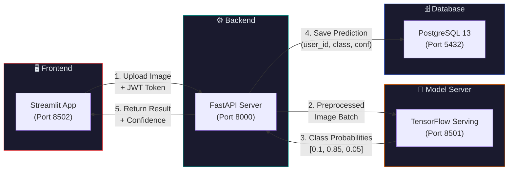
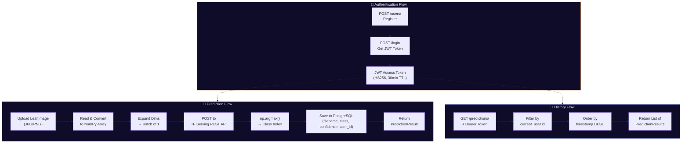
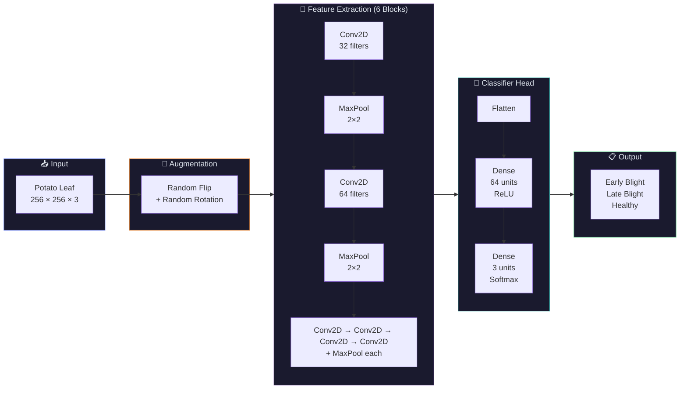
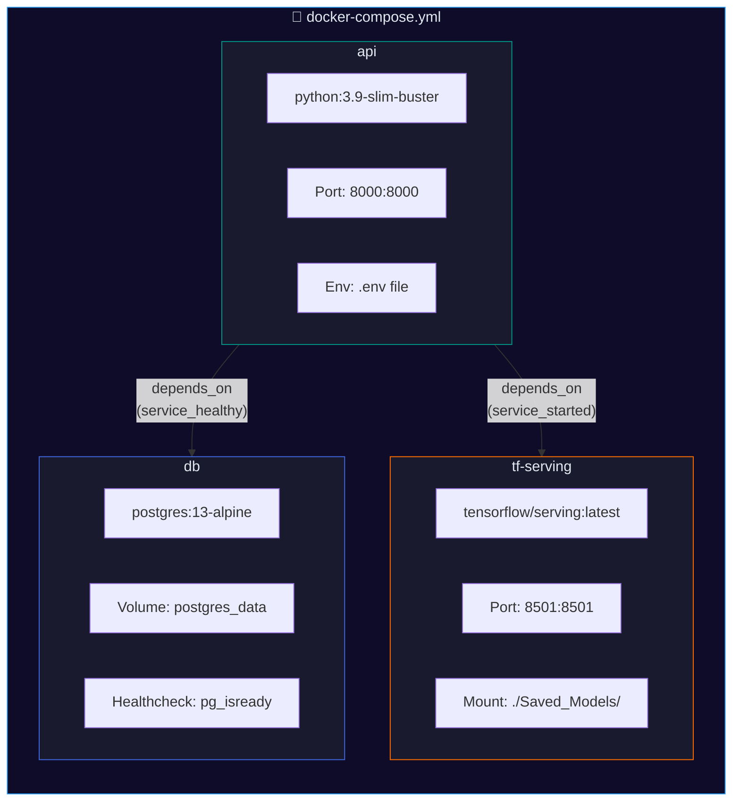
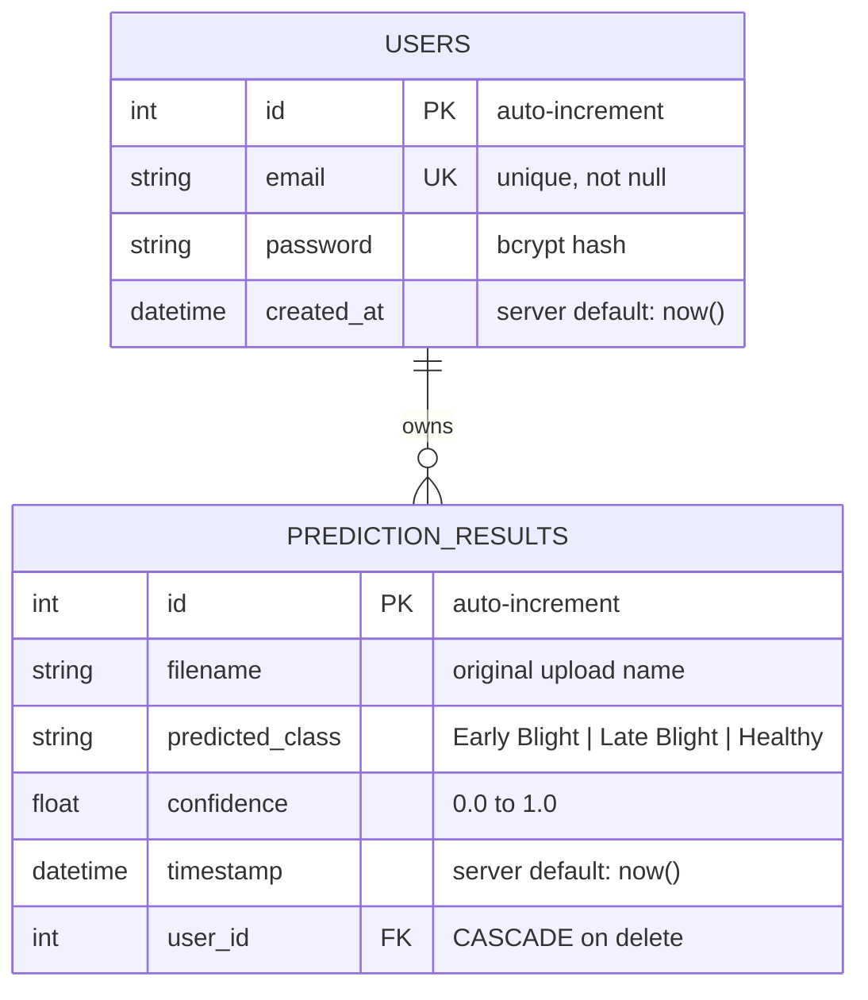

# 🥔 Potato Disease Classification — Full-Stack AI-Powered Leaf Diagnosis

<div align="center">


**A production-ready full-stack application that classifies potato leaf diseases using a CNN served via TensorFlow Serving, a FastAPI backend with JWT authentication, a PostgreSQL database for prediction history, and a Streamlit frontend — all orchestrated with Docker Compose.**

[Architecture](#-system-architecture) · [Disease Classes](#-disease-classes) · [Results](#-model-performance) · [Getting Started](#-getting-started) · [API Reference](#-api-reference) · [How It Works](#-how-it-works)

</div>

---

## 🔬 The Problem

Potato is the **world's 4th largest food crop**, and diseases like Early Blight and Late Blight cause billions of dollars in crop losses annually. Farmers often lack access to plant pathologists, and misidentifying a disease can lead to applying the wrong treatment — wasting money and losing yield.

**Our solution:** Upload a photo of a potato leaf and get an instant, accurate diagnosis. The system classifies leaves into **Early Blight**, **Late Blight**, or **Healthy** — complete with confidence scores, prediction history tracking, and user authentication.

---

## 🏗 System Architecture

The application is composed of four services that communicate in a microservices pattern:



### Detailed Request Flow



---

## 🦠 Disease Classes

The model distinguishes between **3 classes** from the [PlantVillage](https://www.kaggle.com/datasets/arjuntejaswi/plant-village) dataset:

<div align="center">
  <table>
    <tr>
      <td align="center"><b>🟤 Early Blight</b></td>
      <td align="center"><b>⬛ Late Blight</b></td>
      <td align="center"><b>🟢 Healthy</b></td>
    </tr>
    <tr>
      <td></td>
      <td></td>
      <td></td>
    </tr>
    <tr>
      <td align="center"><em>Concentric ring lesions<br/>caused by Alternaria solani</em></td>
      <td align="center"><em>Dark, water-soaked patches<br/>caused by Phytophthora infestans</em></td>
      <td align="center"><em>Uniform green color<br/>with no visible lesions</em></td>
    </tr>
  </table>
</div>

### Dataset Distribution

| Class | Samples | Percentage |
|-------|---------|------------|
| **Early Blight** | 1,000 | 46.4% |
| **Late Blight** | 1,000 | 46.4% |
| **Healthy** | 152 | 7.1% |
| **Total** | **2,152** | 100% |

---

## 📊 Model Performance

### CNN Architecture

The classification model is a custom Convolutional Neural Network built with TensorFlow/Keras:



### Layer-by-Layer Breakdown

| Layer | Type | Filters / Units | Activation | Output Shape |
|-------|------|----------------|------------|-------------|
| 1 | Conv2D | 32 (3×3) | ReLU | 254 × 254 × 32 |
| 2 | MaxPooling2D | 2×2 | — | 127 × 127 × 32 |
| 3 | Conv2D | 64 (3×3) | ReLU | 125 × 125 × 64 |
| 4 | MaxPooling2D | 2×2 | — | 62 × 62 × 64 |
| 5–12 | Conv2D + MaxPool ×4 | progressive | ReLU | downsampled |
| 13 | Flatten | — | — | 1D vector |
| 14 | Dense | 64 | ReLU | 64 |
| 15 | Dense (Output) | 3 | Softmax | 3 |

### Training Configuration

| Parameter | Value |
|-----------|-------|
| **Optimizer** | Adam |
| **Loss Function** | SparseCategoricalCrossentropy |
| **Epochs** | 40 |
| **Input Size** | 256 × 256 × 3 |
| **Pixel Rescaling** | [0, 255] → [0, 1] |
| **Data Augmentation** | Random horizontal/vertical flips, random rotation |
| **Data Split** | 80% train / 10% validation / 10% test |
| **Test Accuracy** | **~85.5%** |

---

## ✨ Features

| Feature | Description |
|---------|-------------|
| 🔐 **JWT Authentication** | Secure registration & login with bcrypt password hashing and HS256 JWT tokens (30-min TTL) |
| 🧠 **CNN Disease Classification** | 3-class CNN distinguishing Early Blight, Late Blight, and Healthy leaves at ~85.5% accuracy |
| 📜 **Prediction History** | Authenticated users can view chronologically sorted history of past predictions, linked to their account |
| ⚡ **High-Performance API** | FastAPI with async endpoints, automatic OpenAPI docs at `/docs`, Pydantic validation |
| 🖥️ **Interactive Web UI** | Streamlit frontend with image upload, real-time results, login/logout, and expandable history panels |
| 🚀 **Scalable Model Serving** | TensorFlow Serving for production-grade, low-latency inference via REST API |
| 🐳 **Docker Compose Orchestration** | Single `docker-compose up` spins up all 3 backend services (API, DB, TF Serving) |
| 🧪 **Comprehensive Test Suite** | Pytest with fixtures for isolated test DB, mock TF Serving, and authorized client testing |

---

## 🚀 Getting Started

### Prerequisites

- [Docker](https://www.docker.com/products/docker-desktop) & [Docker Compose](https://docs.docker.com/compose/install/) installed and running
- [Git](https://git-scm.com/) for cloning the repository
- Python 3.9+ (for running the Streamlit app locally)

### Installation

```bash
# Clone the repository
git clone https://github.com/AshutoshBhate/ML_Projects.git
cd ML_Projects/Potato_Disease_Classification
```

### Environment Configuration

Create a `.env` file in the project root:

```env
# ──── Database ────
DATABASE_HOSTNAME=db                # Docker Compose service name
DATABASE_PORT=5432
DATABASE_PASSWORD=your_strong_password
DATABASE_NAME=potato_disease_db
DATABASE_USERNAME=postgres

# ──── TensorFlow Serving ────
TF_SERVING_URL=http://tf-serving:8501/v1/models/potato_disease_classifier:predict

# ──── JWT Authentication ────
SECRET_KEY=generate_a_strong_random_32_byte_hex_string
ALGORITHM=HS256
ACCESS_TOKEN_EXPIRE_MINUTES=30
```

> **Tip:** Generate a secure `SECRET_KEY` with: `openssl rand -hex 32`

### Launch the Application

**1. Start the backend stack (API + Database + Model Server):**

```bash
docker-compose up --build
```

This starts all three services. The API will be available at **`http://localhost:8000`**.

**2. Start the Streamlit frontend (separate terminal):**

```bash
# Install Streamlit dependencies
pip install streamlit requests Pillow

# Launch on port 8502
streamlit run streamlit_app/app_AfterAuthorization.py --server.port 8502
```

Access the web app at **`http://localhost:8502`**.

### Docker Compose Services



---

## 📡 API Reference

The FastAPI server auto-generates interactive documentation at **`http://localhost:8000/docs`**.

### Authentication

| Method | Endpoint | Auth | Description |
|--------|----------|------|-------------|
| `POST` | `/users/` | ❌ | Register a new user |
| `POST` | `/login` | ❌ | Login and receive JWT token |
| `GET` | `/users/{id}` | ❌ | Get user details by ID |

### Predictions

| Method | Endpoint | Auth | Description |
|--------|----------|------|-------------|
| `POST` | `/predictions/` | 🔐 Bearer | Upload image → get classification result |
| `GET` | `/predictions/` | 🔐 Bearer | Retrieve authenticated user's prediction history |

### Example: Register → Login → Predict

```bash
# 1. Register
curl -X POST http://localhost:8000/users/ \
  -H "Content-Type: application/json" \
  -d '{"email": "farmer@example.com", "password": "strongpass123"}'

# 2. Login (returns JWT)
curl -X POST http://localhost:8000/login \
  -d "username=farmer@example.com&password=strongpass123"
# → {"access_token": "eyJhbGci...", "token_type": "bearer"}

# 3. Predict (with JWT)
curl -X POST http://localhost:8000/predictions/ \
  -H "Authorization: Bearer eyJhbGci..." \
  -F "file=@potato_leaf.jpg"
```

### Sample Prediction Response

```json
{
  "id": 1,
  "timestamp": "2025-08-07T12:05:00.000Z",
  "user_id": 1,
  "filename": "leaf.jpg",
  "predicted_class": "Late Blight",
  "confidence": 0.985,
  "owner": {
    "id": 1,
    "email": "farmer@example.com",
    "created_at": "2025-08-07T12:00:00.000Z"
  }
}
```

---

## 🧠 How It Works

### Image Preprocessing Pipeline

| Step | Operation | Details |
|------|-----------|---------|
| 1 | **Read** | `PIL.Image.open(BytesIO(data))` — decode uploaded bytes |
| 2 | **Convert** | `np.array(image)` — convert to NumPy array |
| 3 | **Batch** | `np.expand_dims(image, 0)` — add batch dimension |
| 4 | **Serialize** | `{"instances": batch.tolist()}` — JSON payload for TF Serving |
| 5 | **Predict** | POST to TF Serving REST endpoint |
| 6 | **Decode** | `np.argmax(predictions[0])` → map to `["Early Blight", "Late Blight", "Healthy"]` |

### Authentication System

| Component | Implementation |
|-----------|---------------|
| **Password Hashing** | `passlib[bcrypt]` — bcrypt with automatic salt |
| **Token Format** | JWT (JSON Web Token) via `python-jose` |
| **Signing Algorithm** | HS256 (HMAC-SHA256) |
| **Token Lifetime** | 30 minutes (configurable via `.env`) |
| **Token Transport** | `Authorization: Bearer <token>` header |
| **User Lookup** | Decode token → extract `user_id` → query PostgreSQL |

### Database Schema



---

## 🧪 Testing and CI/CD

### Test Infrastructure

| Component | Details |
|-----------|---------|
| **Framework** | Pytest + pytest-mock |
| **Test Database** | Isolated `{db_name}_test` database, reset per test function |
| **TF Serving** | Mocked via `unittest.mock` — no model server needed for tests |
| **Client** | FastAPI `TestClient` with dependency injection overrides |

### Test Coverage

| Test | What It Verifies |
|------|-----------------|
| `test_predict_unauthenticated` | Returns `401` when no JWT token is provided |
| `test_predict_success` | Full prediction flow with mocked TF Serving returns correct class & confidence |
| `test_get_prediction_history` | Predictions are stored and retrievable, linked to the correct user |
| `test_create_user` | User creation returns `201` with correct response schema |
| `test_login` | Valid credentials return a JWT access token |
| `test_hash_password` | Bcrypt hashing and verification work correctly |

### Fixtures (`conftest.py`)

| Fixture | Purpose |
|---------|---------|
| `session` | Clean database session — drops & recreates all tables per test |
| `client` | `TestClient` with overridden DB dependency |
| `test_user` | Creates a user via the API and returns their data |
| `authorized_client` | `TestClient` with a pre-set `Authorization: Bearer` header |

### Continuous Integration (CI/CD)

The project uses a **GitHub Actions** workflow (`ci.yml`) that automatically runs on every `push` or `pull_request` to the `master` branch to ensure code quality and stability.

1. **Test Job**: Spins up a temporary PostgreSQL container, installs dependencies, and runs the entire `pytest` suite.
2. **Build & Push Job**: Upon passing tests, builds a new Docker image for the API and pushes it to Docker Hub with the `:latest` tag.
3. **Deploy Job**: Contains placeholder steps demonstrating deployment to a production server after successful build.

### Running Tests Locally

```bash
# From project root
pytest tests/ -v
```

---

## 📁 Project Structure

```
ML_Projects/
├── .github/
│   └── workflows/
│       └── ci.yml                          ← GitHub Actions CI/CD workflow
└── Potato_Disease_Classification/
    ├── README.md                           ← You are here
    ├── docker-compose.yml                  ← Orchestrates API + DB + TF Serving
    ├── .env                                ← Environment variables (not committed)
    ├── Notebook_1.ipynb                    ← Model training & experimentation
    ├── Fundamentals_PotatoDisease.md       ← Background research notes
    │
    ├── PlantVillage/                       ← Training dataset (2,152 images)
    │   ├── Potato___Early_blight/          ← 1,000 images
    │   ├── Potato___Late_blight/           ← 1,000 images
    │   └── Potato___healthy/               ← 152 images
    │
    ├── Saved_Models/                       ← Exported TF SavedModel format
    │   └── 1/
    │       ├── saved_model.pb              ← Model graph definition
    │       ├── keras_metadata.pb           ← Keras layer metadata
    │       └── variables/                  ← Trained weights
    │
    ├── api/                                ← FastAPI backend
    │   ├── main_Routers.py                 ← App entry point, CORS, router inclusion
    │   ├── config.py                       ← Pydantic settings (reads .env)
    │   ├── database.py                     ← SQLAlchemy engine & session
    │   ├── models.py                       ← ORM models (User, PredictionResult)
    │   ├── schemas.py                      ← Pydantic request/response schemas
    │   ├── oauth2.py                       ← JWT creation & verification
    │   ├── utils.py                        ← Password hashing utilities
    │   ├── Dockerfile                      ← Container image for the API
    │   ├── requirements.txt                ← Backend Python dependencies
    │   └── routers/
    │       ├── auth.py                     ← POST /login
    │       ├── user.py                     ← POST /users/, GET /users/{id}
    │       └── prediction.py               ← POST /predictions/, GET /predictions/
    │
    ├── streamlit_app/                      ← Streamlit frontend
    │   ├── app_AfterAuthorization.py       ← Main app (login + predict + history)
    │   ├── app_BeforeAuthorization.py      ← Earlier version (no auth)
    │   ├── requirements.txt                ← Frontend dependencies
    │   └── assets/
    │       └── farmland.jpg                ← Background/hero image
    │
    └── tests/                              ← Pytest test suite
        ├── conftest.py                     ← Fixtures (session, client, test_user)
        ├── test_users.py                   ← User creation & login tests
        ├── test_predictions.py             ← Prediction & history tests
        └── test_utils.py                   ← Utility function tests
```

---

## 🎯 Key Design Decisions

| Decision | Rationale |
|----------|-----------|
| **TensorFlow Serving over embedded model** | Decouples ML inference from business logic; scales independently; standard production pattern |
| **JWT over session cookies** | Stateless authentication — no server-side session storage; works seamlessly across Streamlit ↔ FastAPI |
| **PostgreSQL over SQLite** | Production-grade RDBMS with proper concurrency, type safety, and Docker-native support |
| **Docker Compose orchestration** | Single command deploys the entire stack with correct startup ordering via `depends_on` + healthchecks |
| **Pydantic v2 for schemas** | `ConfigDict(from_attributes=True)` for ORM mode; `EmailStr` for built-in email validation |
| **Separate test database** | Tests run against `{db_name}_test` with per-function reset — zero interference with dev data |
| **Mock TF Serving in tests** | Tests validate API logic without requiring a running model server; faster CI execution |
| **6 Conv + MaxPool blocks** | Enough depth to capture texture and shape features of leaf diseases without overfitting on 2,152 images |

---

## ⚙️ Tech Stack

| Layer | Technology |
|-------|-----------|
| **Deep Learning** | TensorFlow, Keras, TensorFlow Serving |
| **Image Processing** | Pillow (PIL), NumPy |
| **Backend API** | FastAPI, Uvicorn, Pydantic v2 |
| **Database** | PostgreSQL 13, SQLAlchemy (ORM) |
| **Authentication** | python-jose (JWT), passlib[bcrypt] |
| **Frontend** | Streamlit |
| **Containerization** | Docker, Docker Compose |
| **Testing** | Pytest, pytest-mock, FastAPI TestClient |

---

## 🤝 Contributing

Contributions are welcome! If you have ideas, suggestions, or bug reports, please open an issue or submit a pull request.

1. Fork the project
2. Create your feature branch (`git checkout -b feature/AmazingFeature`)
3. Commit your changes (`git commit -m 'Add some AmazingFeature'`)
4. Push to the branch (`git push origin feature/AmazingFeature`)
5. Open a Pull Request

---

## 📄 License

This project is licensed under the MIT License — see the [LICENSE](LICENSE) file for details.

---

<div align="center">
  <b>Built by Ashutosh Bhate</b>
  <br>
  <em>Full-Stack AI · Potato Disease Classification using CNN + FastAPI + Docker</em>
</div>
